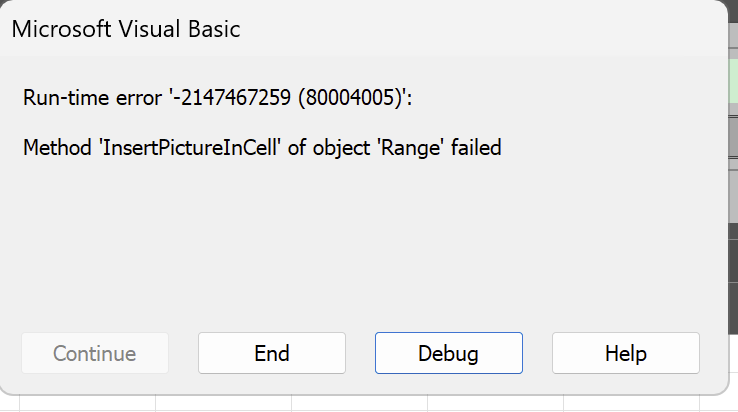
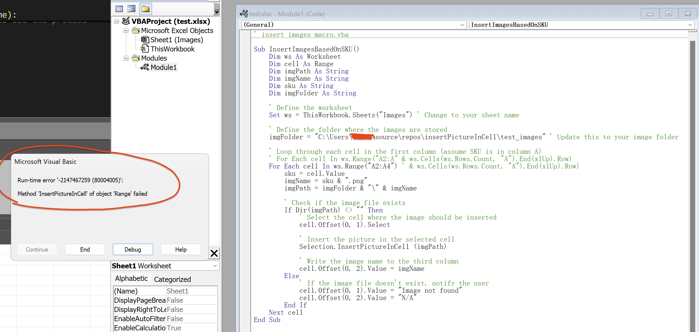
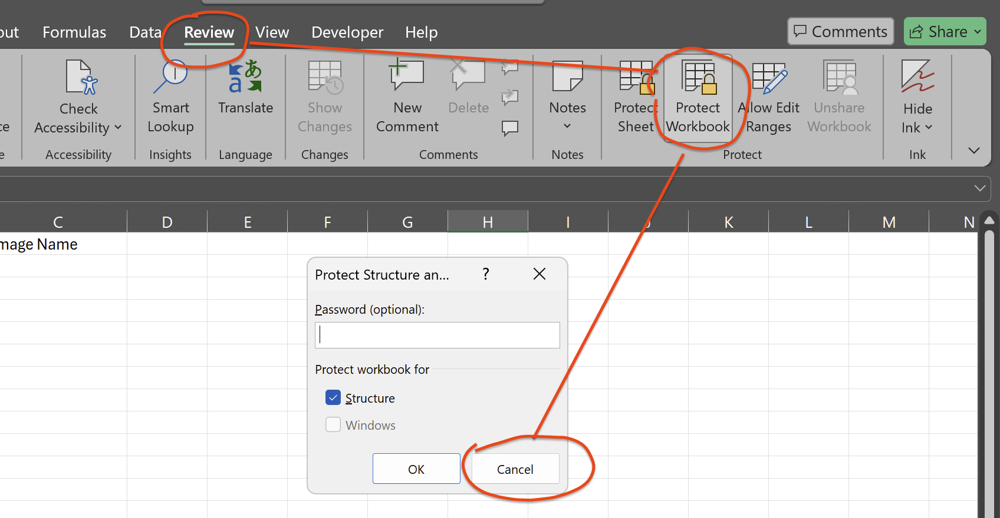
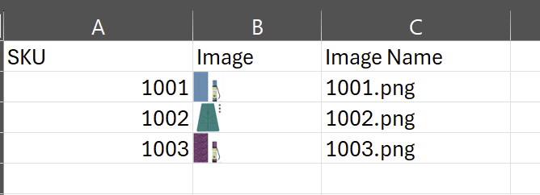

## Need help to avoid error when calling the VBA macro via Python.
##### This Python function is supposed to create an excel file of three columns: SKU, Image, ImageName; 
##### the Image column should have corresponding image file embedded in the cell in the "In Cell Mode".
##### Currently, it encounters issue when the VBA macro is called, shown as below:
1. Run the python code, error occures inside VBA run:

2. Click "End" button, then "Cancel" to keep the excel open; now go to Developer tab and open the Macro editor, run the macro, same error occurs:

3. Next, "End" the macro, go to "Review" tab, click either "Protect Sheet" or "Protect workbook", then click "Cancel": 

4. Now, go back to Macro editor and run the macro again, it works now:
   

## Thank you!
   